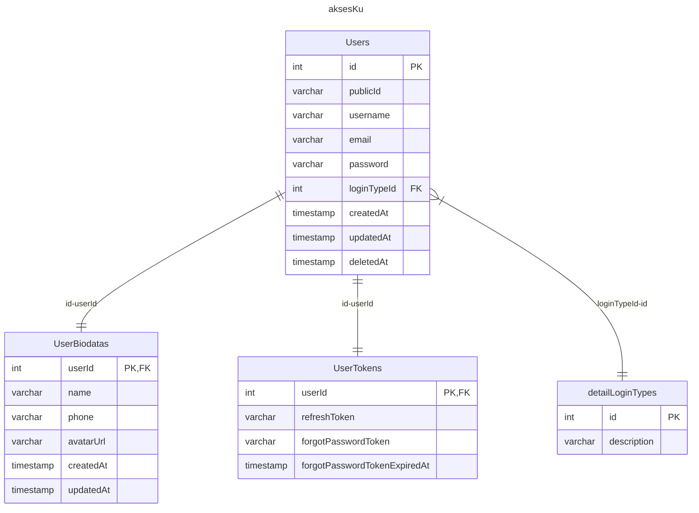

```mermaid
---
title: aksesKu
---

erDiagram
Users {
int id PK
varchar publicId
varchar username
varchar email
varchar password
int loginTypeId FK
timestamp createdAt
timestamp updatedAt
timestamp deletedAt
}

    UserBiodatas {
        int userId PK,FK
        varchar name
        varchar phone
        varchar avatarUrl
        timestamp createdAt
        timestamp updatedAt
    }

    UserTokens {
        int userId PK,FK
        varchar refreshToken
        varchar forgotPasswordToken
        timestamp forgotPasswordTokenExpiredAt
    }

    detailLoginTypes {
        int id PK
        varchar description
    }


    Users ||--||  UserBiodatas : id-userId
    	Users ||--||  UserTokens : id-userId
    Users }|--||  detailLoginTypes : loginTypeId-id

```
